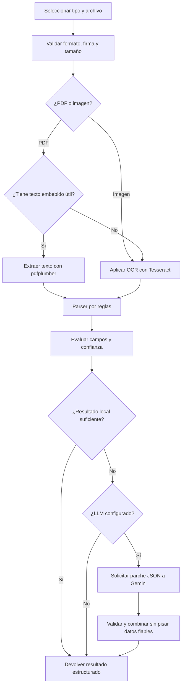

# Document Extractor

Document Extractor es una aplicación full stack pensada para convertir documentos comerciales en datos estructurados y fáciles de revisar. La primera versión habilita facturas y pedidos de compra, pero su arquitectura permite incorporar nuevos tipos documentales como estrategias independientes.

Acepta PDFs digitales, PDFs escaneados e imágenes, muestra cómo se ha obtenido cada dato y asigna un nivel de confianza a los campos extraídos. El flujo sigue un enfoque **local-first e híbrido**: utiliza extracción de texto, OCR y reglas deterministas como camino principal; el modelo de lenguaje solo interviene cuando faltan datos o su confianza es baja. Los archivos no se guardan en la aplicación.

## Índice

1. [Probar la aplicación online](#1-probar-la-aplicación-online)
2. [Qué permite hacer](#2-qué-permite-hacer)
3. [Formas de ejecutar el proyecto](#3-formas-de-ejecutar-el-proyecto)
   - [Opción A: Docker Compose](#opción-a-docker-compose-recomendada)
   - [Opción B: ejecución local sin Docker](#opción-b-ejecución-local-sin-docker)
4. [Cómo funciona la extracción](#4-cómo-funciona-la-extracción)
5. [Arquitectura y decisiones de diseño](#5-arquitectura-y-decisiones-de-diseño)
6. [API](#6-api)
7. [Configuración](#7-configuración)
8. [Tests y calidad](#8-tests-y-calidad)
9. [Limitaciones del despliegue de demostración](#9-limitaciones-del-despliegue-de-demostración)
10. [Punto de vista crítico](#10-punto-de-vista-crítico)

## 1. Probar la aplicación online

La forma más rápida de probar el proyecto es utilizar el despliegue público:

**Frontend:** [https://document-extractor-gules.vercel.app](https://document-extractor-gules.vercel.app)

**API:** [https://backend-production-5b36.up.railway.app/docs](https://backend-production-5b36.up.railway.app/docs)

### Prueba guiada

1. Abre la URL de Vercel.
2. En **Document type**, selecciona `Invoice` o `Purchase order`. La selección es obligatoria porque cada tipo utiliza su propia estrategia de extracción.
3. Arrastra un archivo al área de carga o pulsa **browse files**. La extracción comienza automáticamente al seleccionar el archivo.
4. Espera a que finalice el análisis. Un documento escaneado puede tardar algo más porque cada página debe pasar por OCR.
5. Revisa el resultado:
   - estado global de la extracción;
   - método usado para adquirir el texto (`embedded_text` u `ocr`);
   - método de extracción (`rule_based`, `llm` o `hybrid`);
   - valor y confianza de cada campo;
   - líneas del documento;
   - advertencias o errores controlados.

Para comprobar las rutas principales, utiliza estas cuatro pruebas con datos ficticios:

| Objetivo                  | Tipo seleccionado | Archivo                                         |
| ------------------------- | ----------------- | ----------------------------------------------- |
| Factura PDF con texto     | `Invoice`         | `samples/invoice-modern-spanish.pdf`            |
| Factura procesada con OCR | `Invoice`         | `samples/invoice-receipt-spanish.png`           |
| Pedido PDF con texto      | `Purchase order`  | `samples/purchase-order-industrial-spanish.pdf` |
| Pedido procesado con OCR  | `Purchase order`  | `samples/purchase-order-form-english.jpg`       |

El repositorio contiene ocho muestras en español e inglés. Los formatos admitidos son PDF, JPG, JPEG, PNG, TIFF, BMP y WEBP, con un tamaño máximo de 10 MB por archivo.

> [!NOTE]
> El backend funciona sobre un trial de Railway pensado para pruebas pequeñas y secuenciales. Si el crédito temporal se agota, puedes ejecutar exactamente la misma aplicación con Docker Compose.

## 2. Qué permite hacer

- Seleccionar explícitamente el tipo de documento antes de subirlo.
- Extraer facturas y pedidos de compra mediante estrategias independientes.
- Leer texto embebido en PDFs con `pdfplumber`.
- Procesar imágenes y PDFs escaneados con Tesseract OCR en español e inglés.
- Extraer campos y líneas mediante reglas deterministas.
- Evaluar campos ausentes o con baja confianza.
- Solicitar a Gemini únicamente la información que necesita enriquecimiento.
- Combinar la respuesta semántica sin sustituir datos locales fiables.
- Mostrar resultados completos, parciales y fallidos de forma controlada.
- Validar extensión, MIME, firma binaria, contenido y tamaño antes de procesar.
- Evitar la persistencia de los documentos y resultados en esta primera versión.
- Añadir nuevos tipos de documento sin acoplarlos a las estrategias existentes.

La interfaz anticipa albaranes, partes de trabajo e informes de mantenimiento como futuras opciones. Están deshabilitados hasta que cuenten con sus propios modelos, reglas, schemas, prompts y tests.

## 3. Formas de ejecutar el proyecto

El proyecto puede probarse de tres formas, en este orden recomendado:

1. **Vercel + Railway:** no requiere instalación y permite revisar el producto terminado inmediatamente.
2. **Docker Compose:** reproduce toda la aplicación localmente con Tesseract y sus idiomas ya instalados.
3. **Ejecución local sin Docker:** es la opción más cómoda para desarrollar, pero requiere instalar Python, Node y Tesseract en el equipo.

| Modo | Frontend | Backend | Comunicación |
|---|---|---|---|
| Local sin Docker | `http://localhost:4200` | `http://localhost:8000` | Angular reenvía `/api` mediante su proxy de desarrollo |
| Docker Compose | `http://localhost:8080` | `http://localhost:8000` | Nginx escucha dentro del contenedor en `80` y reenvía `/api` al backend en `8000` |
| Hospedado | Vercel mediante HTTPS | Railway mediante HTTPS | El navegador llama al dominio público del backend |

### Opción A: Docker Compose (recomendada)

Esta opción solo necesita Docker Desktop o Docker Engine con el plugin de Compose. No requiere instalar Python, Node, Angular CLI ni Tesseract en el sistema anfitrión.

#### 1. Preparar la configuración

El archivo `.env` tiene que estar en la raíz del proyecto. Si no lo has recibido junto con la entrega, créalo a partir de la plantilla:

Windows CMD:

```cmd
copy .env.example .env
```

PowerShell:

```powershell
Copy-Item .env.example .env
```

macOS o Linux:

```bash
cp .env.example .env
```

> [!IMPORTANT]
> La plantilla ya incluye la URL y el modelo de Gemini. Para probar el modo híbrido, añade tu clave de API en `LLM_API_KEY`.
>
> Si no tienes una clave o la clave de ejemplo ha caducado:
>
> 1. Accede a https://aistudio.google.com/apikey
> 2. Inicia sesión con tu cuenta de Google.
> 3. Pulsa **Create API key**.
> 4. Copia la clave generada y pégala en `LLM_API_KEY`.
>
> Si prefieres utilizar únicamente el procesamiento local, establece:
>
> ```env
> LLM_ENABLED=false
> ```

#### 2. Construir y arrancar

Desde la raíz del repositorio:

```bash
docker compose up --build
```

La primera construcción tarda más porque descarga las imágenes base, instala Tesseract y compila Angular. Cuando ambos contenedores estén listos, abre:

- Aplicación: [http://localhost:8080](http://localhost:8080)
- API: [http://localhost:8000](http://localhost:8000)
- Swagger/OpenAPI: [http://localhost:8000/docs](http://localhost:8000/docs)
- Health check: [http://localhost:8000/api/health](http://localhost:8000/api/health)

En este modo Nginx sirve el frontend compilado y reenvía las peticiones `/api` al contenedor de FastAPI.

#### 3. Detener la aplicación

Pulsa `Ctrl+C` en la terminal donde se está ejecutando Compose y elimina los contenedores:

```bash
docker compose down
```

### Opción B: ejecución local sin Docker

Esta modalidad ejecuta Angular en el puerto `4200` y FastAPI en el `8000`. Resulta útil para desarrollar porque Angular y Uvicorn recargan los cambios sin reconstruir imágenes.

#### Requisitos

- Python `3.12.x` (el backend requiere `>=3.12,<3.13`).
- Node.js `24.x`, como mínimo `24.15`, con npm 11.
- Tesseract OCR 5 con los idiomas `spa` y `eng`.

No es necesario instalar Angular CLI ni TypeScript globalmente: `npm ci` instala las versiones del proyecto dentro de `frontend/node_modules`.

#### 1. Instalar y comprobar Tesseract

Tesseract es imprescindible para imágenes y PDFs escaneados. Sin él, los PDFs con texto embebido seguirán funcionando, pero el backend devolverá el error controlado `ocr_unavailable` cuando necesite OCR.

En Windows, instala Tesseract 5 incluyendo los datos de idioma español e inglés. Después comprueba desde una terminal nueva:

```cmd
tesseract --version
tesseract --list-langs
```

La segunda orden tiene que mostrar al menos `eng` y `spa`. Si Windows no encuentra el ejecutable, indica su ruta en el `.env`:

```env
TESSERACT_CMD=C:\Program Files\Tesseract-OCR\tesseract.exe
```

En Ubuntu/Debian:

```bash
sudo apt update
sudo apt install tesseract-ocr tesseract-ocr-eng tesseract-ocr-spa
```

En macOS con Homebrew:

```bash
brew install tesseract tesseract-lang
```

#### 2. Crear el entorno del backend

Desde la raíz del proyecto, en Windows CMD:

```cmd
py -3.12 -m venv backend\.venv
backend\.venv\Scripts\activate
python -m pip install --upgrade pip
python -m pip install -e "backend[dev]"
```

En PowerShell, la activación equivalente es:

```powershell
backend\.venv\Scripts\Activate.ps1
```

En macOS o Linux:

```bash
python3.12 -m venv backend/.venv
source backend/.venv/bin/activate
python -m pip install --upgrade pip
python -m pip install -e "backend[dev]"
```

#### 3. Preparar el frontend

En otra terminal:

```bash
cd frontend
npm ci
```

Se utiliza `npm ci` porque el repositorio incluye `package-lock.json` y así se instalan exactamente las versiones verificadas.

#### 4. Preparar las variables

Si no existe `.env` en la raíz, cópialo desde `.env.example`. La plantilla deja Gemini preparado, por lo que para activar el modo híbrido solo tienes que rellenar:

```env
LLM_API_KEY=your-temporary-key
```

Para ejecutar únicamente la extracción local, sin ninguna credencial externa, utiliza:

```env
LLM_ENABLED=false
```

Si se cambia a otro proveedor, entonces sí deben actualizarse conjuntamente `LLM_BASE_URL`, `LLM_API_KEY` y `LLM_MODEL`. El backend rechaza configuraciones parciales para detectar el error al arrancar.

#### 5. Arrancar FastAPI

Con el entorno virtual activado:

```bash
cd backend
uvicorn document_extractor.main:app --reload --port 8000
```

Comprueba que [http://localhost:8000/api/health](http://localhost:8000/api/health) devuelve:

```json
{"status":"ok"}
```

#### 6. Arrancar Angular

En la terminal del frontend:

```bash
npm start
```

Abre [http://localhost:4200](http://localhost:4200). El servidor de desarrollo utiliza `frontend/proxy.conf.json` para enviar `/api` a FastAPI, por lo que no es necesario cambiar URLs en el código.

## 4. Cómo funciona la extracción

El flujo separa la lectura del archivo, la lógica de negocio y la presentación:

1. El usuario selecciona un tipo de documento y sube un archivo.
2. FastAPI valida el tipo, el tamaño, el MIME y la firma binaria.
3. En PDFs se intenta primero obtener el texto embebido. Si no hay texto útil, o si el documento es una imagen, se utiliza Tesseract OCR.
4. La estrategia del tipo seleccionado aplica su parser por reglas.
5. El dominio evalúa cobertura, campos ausentes y confianza.
6. Si el resultado local es suficiente, se devuelve sin llamar a servicios externos.
7. Si necesita ayuda y existe un proveedor configurado, se solicita un parche JSON estructurado para los campos problemáticos. Cuando la cobertura local es muy baja se solicita una extracción semántica completa.
8. El resultado del LLM se valida y combina con el local, conservando los datos fiables obtenidos por reglas.
9. Angular presenta valores, líneas, confianza, advertencias y método utilizado.



### Privacidad del flujo

Los archivos y resultados no se persisten en una base de datos. El OCR y las reglas se ejecutan dentro del backend. Cuando el enriquecimiento con IA está activo y resulta necesario, el texto extraído —no el archivo original— se envía al proveedor configurado. No uses documentos reales o sensibles en esta demostración.

## 5. Arquitectura y decisiones de diseño

### Stack

| Área         | Tecnología                                 | Responsabilidad                                   |
| ------------ | ------------------------------------------ | ------------------------------------------------- |
| Frontend     | Angular 22, TypeScript 6, RxJS             | Selección, carga y presentación del resultado     |
| API          | FastAPI, Pydantic, Uvicorn                 | Validación HTTP, composición y respuestas tipadas |
| PDF          | pdfplumber                                 | Extracción de texto embebido                      |
| OCR          | Tesseract, Pillow, pypdfium2               | Imágenes y renderizado de PDFs escaneados         |
| Extracción   | Reglas + cliente LLM compatible con OpenAI | Parsing local y enriquecimiento semántico         |
| Contenedores | Docker Compose, Nginx                      | Ejecución reproducible y proxy local              |
| Hosting      | Vercel + Railway                           | Frontend estático y backend en contenedor         |

### Backend

El backend utiliza una arquitectura hexagonal ligera:

```text
backend/src/document_extractor/
├── domain/          modelos, evaluación, merge y puertos
├── application/     casos de uso y orquestación local-first
├── infrastructure/  lectores, OCR, parsers y adaptador LLM
├── presentation/    API, validación, schemas y estrategias
└── main.py          creación y configuración de FastAPI
```

Las estrategias `invoice` y `purchase_order` comparten adquisición, validación y política de enriquecimiento, pero mantienen modelos, parsers, prompts y schemas independientes. Un nuevo tipo documental se incorpora registrando una nueva estrategia sin modificar las implementaciones existentes.

### Frontend

El frontend organiza Angular por funcionalidad:

```text
frontend/src/app/
├── core/            configuración y modelos compartidos
├── features/upload/ selección del tipo y carga
├── features/extraction/ acceso a API y selección del resultado
├── features/invoice/ presentación de facturas
├── features/purchase-order/ presentación de pedidos
└── shell/           composición de la pantalla y estado global
```

El origen de la API no está fijado en TypeScript: en desarrollo se usa un proxy, en Docker se encarga Nginx y en Vercel se inyecta durante el build.

## 6. API

| Método | Ruta               | Descripción                              |
| ------ | ------------------ | ---------------------------------------- |
| `GET`  | `/api/health`      | Comprueba que el proceso está disponible |
| `POST` | `/api/extractions` | Extrae un documento con el tipo indicado |
| `GET`  | `/docs`            | Interfaz Swagger generada por FastAPI    |

`POST /api/extractions` recibe `multipart/form-data`:

- `document_type`: `invoice` o `purchase_order`.
- `file`: PDF o imagen compatible.

Ejemplo desde Windows CMD o PowerShell, ejecutado en la raíz del proyecto:

```cmd
curl.exe -X POST "http://localhost:8000/api/extractions" -F "document_type=invoice" -F "file=@samples/invoice-modern-spanish.pdf;type=application/pdf"
```

En macOS o Linux puedes usar la misma petición dividida en varias líneas:

```bash
curl -X POST "http://localhost:8000/api/extractions" \
  -F "document_type=invoice" \
  -F "file=@samples/invoice-modern-spanish.pdf;type=application/pdf"
```

La respuesta incluye `status`, `document_type`, `acquisition_method`, `extraction_method`, `fields`, `line_items`, `warnings` y `errors`. Los errores HTTP usan códigos estables y, ante un fallo inesperado, un identificador de correlación que permite localizar el diagnóstico en logs.

## 7. Configuración

El backend lee `.env` desde la raíz del repositorio. Las variables principales son:

| Variable                   | Valor por defecto       | Uso                                                |
| -------------------------- | ----------------------- | -------------------------------------------------- |
| `MAX_UPLOAD_MB`            | `10`                    | Tamaño máximo del archivo                          |
| `CORS_ORIGINS`             | `http://localhost:4200` | Orígenes web permitidos, separados por comas       |
| `OCR_LANGUAGES`            | `spa+eng`               | Idiomas de Tesseract                               |
| `OCR_DPI`                  | `300`                   | Resolución para renderizar PDFs escaneados         |
| `OCR_MAX_PAGES`            | `20`                    | Límite de páginas o frames procesados por OCR      |
| `OCR_MAX_PIXELS_PER_PAGE`  | `40000000`              | Protección de memoria por página                   |
| `TESSERACT_CMD`            | vacío                   | Ruta al ejecutable cuando no está en `PATH`        |
| `LLM_ENABLED`              | `true`                  | Activa o desactiva el enriquecimiento              |
| `LLM_BASE_URL`             | vacío                   | Endpoint compatible con el formato OpenAI          |
| `LLM_API_KEY`              | vacío                   | Credencial del proveedor                           |
| `LLM_MODEL`                | vacío                   | Modelo utilizado                                   |
| `LLM_TIMEOUT_SECONDS`      | `30`                    | Timeout de la petición externa                     |
| `LLM_MAX_INPUT_CHARACTERS` | `60000`                 | Máximo texto enviado al proveedor                  |
| `LLM_MAX_OUTPUT_TOKENS`    | `2500`                  | Máximo de tokens de respuesta                      |
| `LLM_STRICT_SCHEMA`        | `false`                 | Solicita schema estricto si el proveedor lo admite |

Configuración utilizada para Gemini:

```env
LLM_ENABLED=true
LLM_BASE_URL=https://generativelanguage.googleapis.com/v1beta/openai
LLM_API_KEY=replace-with-a-temporary-key
LLM_MODEL=gemini-2.5-flash
LLM_STRICT_SCHEMA=false
```

La clave temporal de evaluación se entrega fuera del repositorio. Copia `.env.example` como `.env` y añade únicamente el valor de `LLM_API_KEY`. Si quieres probar solo la extracción por reglas, utiliza `LLM_ENABLED=false`.

## 8. Tests y calidad

### Backend

Con `backend/.venv` activado:

```bash
cd backend
python -m pytest
ruff check .
ruff format --check .
```

La suite cubre validación de la API, firmas de archivo, lectura de PDF, OCR, preprocesado de imagen, parsers por reglas, política de enriquecimiento, merge, cliente LLM y configuración del proveedor.

### Frontend

```bash
cd frontend
npm test
npm run build
```

Los tests verifican la selección obligatoria del tipo, la carga, el acceso a la API, el estado de la pantalla y la representación específica de facturas y pedidos de compra.

### Aplicación completa

```bash
docker compose up --build
```

Después, comprueba el health check y realiza al menos una extracción de PDF y otra de imagen desde [http://localhost:8080](http://localhost:8080).

## 9. Limitaciones del despliegue de demostración

El despliegue público está pensado para pequeñas pruebas funcionales y no para medir rendimiento:

- Railway utiliza un trial temporal y medido por consumo. El servicio puede quedar suspendido al expirar el periodo o agotarse el crédito.
- El contenedor tiene recursos limitados. Varias operaciones OCR simultáneas o documentos grandes pueden aumentar mucho la latencia o consumir la memoria.
- Gemini aplica sus propias cuotas y límites de frecuencia. Si el proveedor no responde, se conserva el resultado local cuando ya existe.
- No hay rate limiting, autenticación ni aislamiento por usuario; no sometas la URL pública a pruebas de carga.
- El límite de aplicación es de 10 MB y el OCR restringe páginas y píxeles para evitar consumos accidentales.

Estas restricciones no afectan a la evaluación normal con las muestras del repositorio y peticiones secuenciales.

## 10. Punto de vista crítico

### ¿Qué limitaciones tiene la solución actual?

La extracción por reglas se ha probado con documentos controlados y variantes razonables, pero no contra un dataset amplio de documentos reales. Puede perder precisión ante diseños muy distintos, tablas complejas, campos ambiguos o texto obtenido en un orden inesperado. Del mismo modo, el OCR depende de la resolución, orientación, contraste y ruido de la imagen; documentos borrosos, manuscritos o con muchas columnas siguen siendo difíciles.

La confianza de cada campo es heurística, no una probabilidad calibrada con un conjunto de validación. El LLM mejora la flexibilidad, pero añade latencia, dependencia de red, cuota, coste y consideraciones de privacidad. En esta versión recibe texto y no la representación visual completa del documento.

Desde el punto de vista de producto, no existen usuarios, clientes, permisos, historial ni persistencia. La extracción se completa dentro de la misma petición HTTP, por lo que un documento complejo puede aumentar el tiempo de respuesta. Tampoco hay antivirus, rate limiting, cuotas por usuario, revisión humana ni auditoría de accesos. Estas decisiones reducen el alcance y el riesgo de la prueba, pero no serían suficientes para procesar documentación real de clientes.

### ¿Qué cambiarías con más tiempo o si esto fuera a producción?

Empezaría por construir el producto alrededor del extractor:

- Autenticación, organizaciones, roles y permisos.
- PostgreSQL para usuarios, clientes, documentos, resultados, versiones y correcciones.
- Almacenamiento de objetos compatible con S3 para originales y derivados, con cifrado, retención y borrado verificable.
- Historial, búsqueda, revisión manual, corrección por campo y exportación a sistemas externos.
- Nuevos tipos documentales como albaranes, partes de trabajo e informes de mantenimiento, cada uno con su estrategia, modelos, parser y tests.

Además, reforzaría la parte técnica con mejoras proporcionadas al uso real:

- Más documentos reales anonimizados, métricas por campo y casos de regresión.
- Mejoras de OCR para orientación, ruido y layouts más complejos.
- Integración continua para ejecutar automáticamente tests, lint y builds.
- Gestión segura de secretos y credenciales.
- Observabilidad mejorada mediante logs y métricas cuando fuera necesario.
- Elección de la infraestructura y el servidor según el volumen, el coste, los requisitos legales y el mantenimiento que pudiera asumir el equipo.

### ¿Qué enfoque de extracción consideraste y por qué descartaste el alternativo?

Consideré dos extremos. Una solución basada solo en reglas es rápida, barata, reproducible, fácil de probar y mantiene los datos dentro del backend, pero se vuelve frágil cuando cambian el proveedor, el idioma o la plantilla. Una solución basada solo en LLM reduce las reglas específicas y entiende mejor las variaciones, pero introduce respuestas menos deterministas, coste, latencia, dependencia externa y riesgos de privacidad; además, usarla incluso para campos que ya pueden resolverse localmente sería innecesario.

Por eso no elegí ninguno de los dos extremos. El enfoque final es híbrido y local-first: extracción de texto u OCR, reglas y evaluación de confianza como camino principal; enriquecimiento semántico únicamente para los huecos. Así se mantiene un comportamiento útil sin credenciales, se reducen las llamadas externas y el resultado del modelo queda limitado por schemas y por un merge que protege los valores locales fiables.
